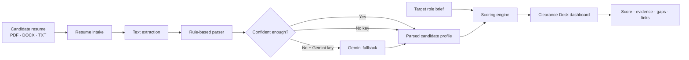
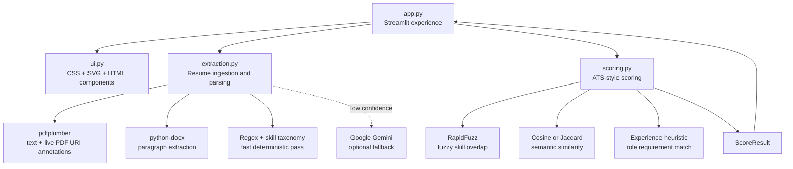

<div align="center">

# Clearance Desk

### Resume intelligence for the moment before the interview slate.

A polished, explainable ATS-style workspace that parses a candidate resume, compares it with a target role, and returns a fit signal with evidence—not a black-box verdict.

[](https://www.python.org/)
[](https://streamlit.io/)
[](https://ai.google.dev/gemini-api/docs)
[](https://pypi.org/project/pdfplumber/)
[](https://github.com/rapidfuzz/RapidFuzz)
[](#license)

<br />


</div>

> **Clearance Desk** is designed as a fast first-pass review surface: structured enough to explain why a score moved, lightweight enough to run locally, and graceful enough to work without an AI key.

## Why this exists

Resume screening often begins with two unstructured documents: a candidate file and a role brief. Clearance Desk turns that comparison into a focused review flow. It extracts the candidate’s contact details, skills, experience, education, and public profiles; evaluates the profile against the role; and presents the result as a visual decision layer with supporting evidence.

The parser uses deterministic rules first. When a PDF contains a clickable LinkedIn or GitHub label without printing the destination URL, the ingestion layer also reads the PDF’s hyperlink annotations. If the rule pass is not confident enough and a Gemini key is configured, the app can use the model as a targeted fallback. Without a key, the app remains usable through rule-based extraction and word-overlap similarity.

## What the reviewer gets

| Surface | What it shows |
| --- | --- |
| **Overall fit** | A weighted score from 0–100 with a clear, conditional, or rejected signal. |
| **Score composition** | Skill overlap, semantic similarity, and experience match with their contribution weights. |
| **Candidate file** | Name, email, phone, detected experience, LinkedIn, and GitHub links. |
| **Matched skills** | Role skills that were found in the resume through fuzzy matching. |
| **Flagged gaps** | Role skills that were not confidently found and deserve human investigation. |
| **Field note** | An optional concise strengths-and-gaps summary generated by Gemini. |
| **Source record** | The raw structured extraction for transparent review and debugging. |

## Product flow



## Architecture

Clearance Desk keeps the presentation layer, parsing layer, and scoring layer separate so each part can evolve without turning the app into a monolith.



### Module map

| Module | Responsibility |
| --- | --- |
| `app.py` | Orchestrates intake, validation, parsing, scoring, and the results experience. |
| `ui.py` | Owns the custom dark review-console design system, SVG fit gauge, score bars, badges, cards, and responsive styling. |
| `extraction.py` | Loads PDF/DOCX/TXT files, extracts visible text and live PDF links, applies rules, and optionally merges Gemini fallback data. |
| `scoring.py` | Computes skill overlap, semantic similarity, experience match, the weighted score, and optional gap analysis. |
| `requirements.txt` | Pins the runtime dependencies needed for local development and deployment. |
| `runtime.txt` | Declares the Python runtime used by the deployment target. |

## Scoring model

The overall score is intentionally decomposable. Each component stays visible in the interface so a reviewer can understand the shape of the result instead of receiving a single unexplained number.

\[
\text{Overall Fit} = 0.45(\text{Skill Overlap}) + 0.35(\text{Semantic Similarity}) + 0.20(\text{Experience Match})
\]

| Component | Weight | Method |
| --- | ---: | --- |
| **Skill overlap** | 45% | Fuzzy matching between role skills and the resume’s normalized skill set. |
| **Semantic similarity** | 35% | Gemini embeddings when available; Jaccard word overlap as a no-key fallback. |
| **Experience match** | 20% | Compares detected candidate years with the number of years requested in the role brief. |

| Decision signal | Threshold | Interpretation |
| --- | ---: | --- |
| **CLEARED** | 75–100 | Strong alignment; suitable for shortlist consideration. |
| **CONDITIONAL** | 50–74 | Mixed signal; review the evidence and gaps manually. |
| **REJECTED** | 0–49 | Low alignment under the current scoring configuration. |

These thresholds support triage only. They are not a replacement for human judgment, structured interviews, or role-specific evaluation.

## Link-aware resume parsing

A common resume pattern is to display `LinkedIn` or `GitHub` as styled text while storing the actual destination only in the PDF’s clickable annotation layer. A plain text extractor cannot see that destination. Clearance Desk handles both representations:

1. It scans visible text for printed profile URLs.
2. It reads `pdfplumber` hyperlink and annotation URI values.
3. It normalizes profile destinations to absolute `https://` URLs.
4. It exposes the result as clickable links in the candidate file card.

This keeps the parser useful for resumes that are visually clean but structurally sparse.

## Local setup

### 1. Clone the repository

```bash
git clone https://github.com/Samarssj/Clearance_desk.git
cd Clearance_desk
```

### 2. Create an environment and install dependencies

```bash
python3.11 -m venv .venv
source .venv/bin/activate
pip install -r requirements.txt
```

### 3. Configure optional Gemini fallback

Create a local `.env` file and add a key only if you want Gemini-assisted fallback extraction, embeddings, and field notes:

```dotenv
GEMINI_API_KEY=your_api_key_here
```

The app remains functional without this key. In no-key mode, it uses deterministic extraction and a word-overlap similarity fallback.

### 4. Run the app

```bash
streamlit run app.py
```

Then open the local URL printed by Streamlit, usually `http://localhost:8501`.

## Deployment notes

Clearance Desk is compatible with Streamlit Community Cloud and other Python-friendly hosts. Configure `GEMINI_API_KEY` as a platform secret rather than committing it to the repository. The application accepts PDF, DOCX, and TXT resumes and does not require Gemini for its baseline workflow.

## Development checklist

Before opening a pull request, run the following checks:

```bash
python3 -m py_compile app.py ui.py extraction.py scoring.py
git diff --check
```

For link extraction changes, include a PDF fixture whose visible text contains only `LinkedIn`/`GitHub` labels while the destinations live in PDF URI annotations. This protects the regression path that ordinary text-only tests miss.

## Roadmap

| Direction | Product value |
| --- | --- |
| **Batch screening** | Rank multiple resumes against a shared role brief. |
| **Resume rewrite guidance** | Turn flagged gaps into targeted improvement suggestions. |
| **Broader document support** | Add RTF and OCR-assisted image-based PDF handling. |
| **Skill taxonomy** | Replace the seed list with a richer taxonomy such as ESCO or O*NET. |
| **Caching** | Avoid re-parsing identical documents across repeated sessions. |
| **Reviewer controls** | Allow teams to tune weights and thresholds per role family. |

## License

This project is available under the MIT License. Add the full license text to a `LICENSE` file before distributing the project publicly.

## References

[1]: https://docs.streamlit.io/ "Streamlit documentation"
[2]: https://ai.google.dev/gemini-api/docs "Gemini API documentation"
[3]: https://pypi.org/project/pdfplumber/ "pdfplumber on PyPI"
[4]: https://github.com/rapidfuzz/RapidFuzz "RapidFuzz repository"
[5]: https://python-docx.readthedocs.io/ "python-docx documentation"
[6]: https://www.python.org/ "Python"
